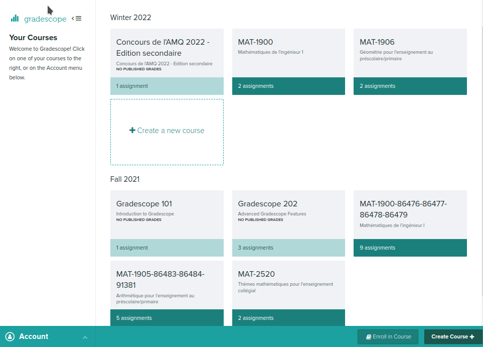
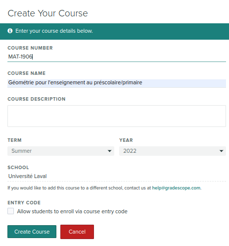

===============
Créer le cours
===============

1. Il faut se connecter à Gradescope. La plateforme utilisée est `gradescope.com <https://www.gradescope.com/>`_. Vous pouvez vous y connecter directement si vous avez déjà un compte. Dans le cas contraire, créez-vous-en un.

2. Une fois connecté, vous devriez voir un rectangle dans lequel il est écrit *Create a new course*. Cliquez dessus.

3. Vous pourrez alors saisir les détails du cours. Il est possible de laisser les étudiants s'ajouter au cours eux-mêmes en saisissant un *course entry code*, mais je ne vous suggère pas cette option. En les ajoutant nous-mêmes, nous avons un meilleur contrôle des membres du cours et on s'assure que ceux qui n'ont pas d'affaire à y être n'y sont pas.

