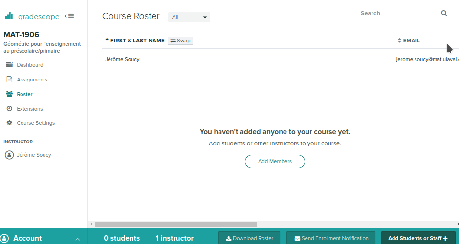
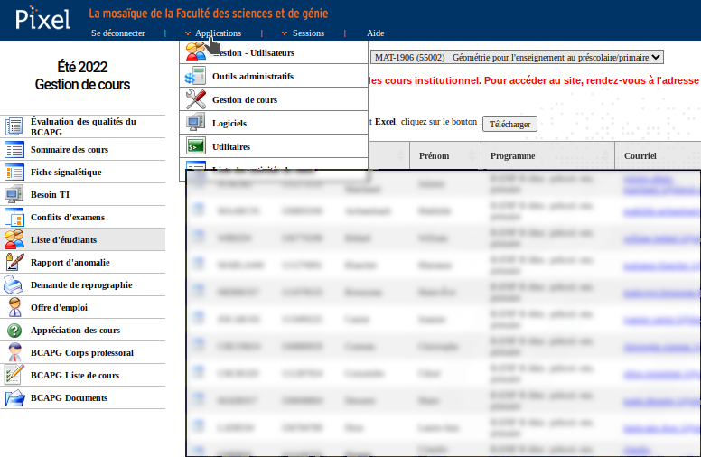
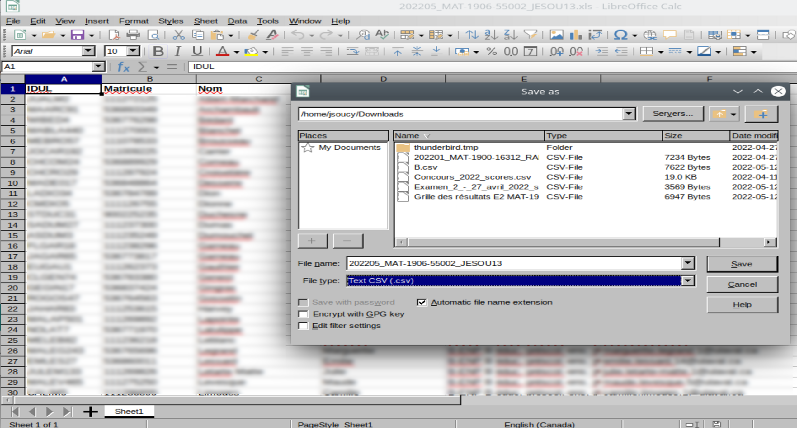
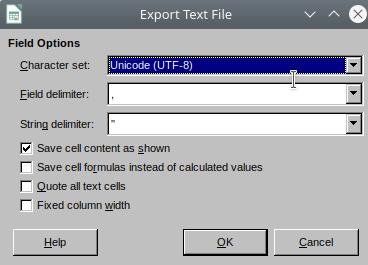
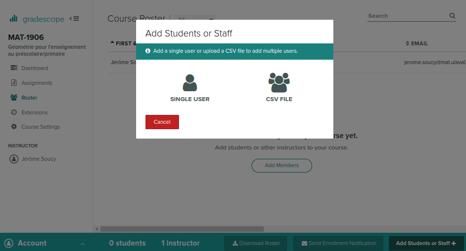
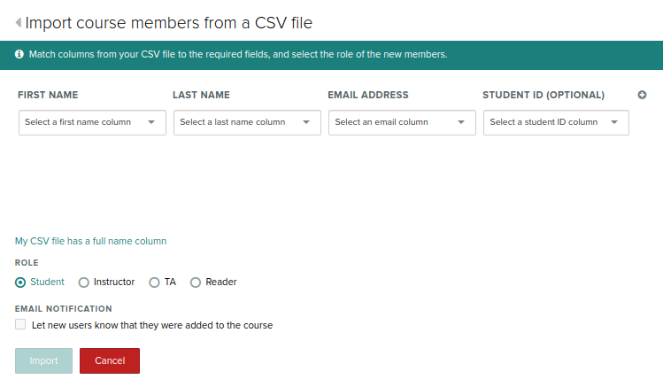

==========================================
Ajouter les membres du cours
==========================================

Les membres du cours sont les personnes qui enseignent, qui corrigent et bien sûr, les étudiant(e)s. Les rôles attribués par Gradescope sont distincts pour chacun de ces groupes.

Ajouter les autres enseignants et les correcteurs
--------------------------------------------------
1. Cliquez sur **Roster** dans le menu de gauche.

2. Cliquez sur **Add Student or Staff** sur le bouton en bas à droite.

    
3. Cliquez sur **SINGLE USER**.

4. Saisissez l'information relative à la personne à ajouter. Les enseignants doivent avoir le rôle **Instructor** et les correcteurs **TA** (*Teaching Assistant*).

5. Répétez jusqu'à ce que tous les enseignants et correcteurs ait été ajoutés.

Créer la liste des étudiants
-------------------------------
L'ajout des étudiants pourrait se faire de la même manière que pour les enseignants et le correcteurs, mais étant donné leur plus grand nombre, il est beaucoup plus rapide de le faire via l'importation d'une liste d'étudiants.

1. Se rendre sur `Pixel <https://pixel.fsg.ulaval.ca/>`_ et s'y connecter.
2. Dans le menu supérieur, choisir **Applications**, puis cliquer sur l'item **Gestion de cours**.
3. Dans le menu de gauche, cliquer sur **Liste d'étudiants**. Un bouton **Télécharger** s'affiche au haut de la liste d'étudiants. On clique dessus pour télécharger le fichier Excel.

    
4. On ouvre le fichier Excel téléchargé. On doit l'enregistrer au format CSV (*Comma-separated values*). C'est ce fichier que lira Gradescope.

    
5. S'assurer que le format de fichier choisi lors de l'enregistrement au format CSV soit UTF-8. Dans le cas contraire, vous risquez d'avoir des caractères de remplacement pour les lettres accentuées.

     
Téléverser la liste d'étudiants sur Gradescope
---------------------------------------------------

1. Cliquez sur la pastille correspondant au cours pour lequel vous souhaitez ajouter les étudiants. Ensuite, cliquez sur **Roster** dans le menu de gauche, puis sur **Add Student or Staff** en bas à droite.

    
2. Cliquer sur l'icône **CSV FILE** et choisissez le fichier CSV enregistré sur le disque dur un peu plus tôt.

    
3. Il faut spécifier à Gradescope dans quelles colonnes se trouvent les informations requises. Comme le fichier CSV obtenu de Pixel comporte une colonne pour le prénom et une autre pour le nom, assurez-vous de cliquer sur *My CSV file has separate first and last name columns*.

    
4. Je vous suggère ensuite de décocher la notification de l'ajout par courriel à l'étudiant. Il m'apparaît préférable de leur écrire un courriel uniquement lorsque leur premier examen est disponible pour consultation sur Gradescope. Ça évite d'une part qu'ils reçoivent un courriel externe à l'Université, en anglais de surcroît, et d'autre part ils risquent de l'oublier entre le moment où ils ont été ajoutés à un cours et celui où il pourront consulter une copie d'examen corrigée.
