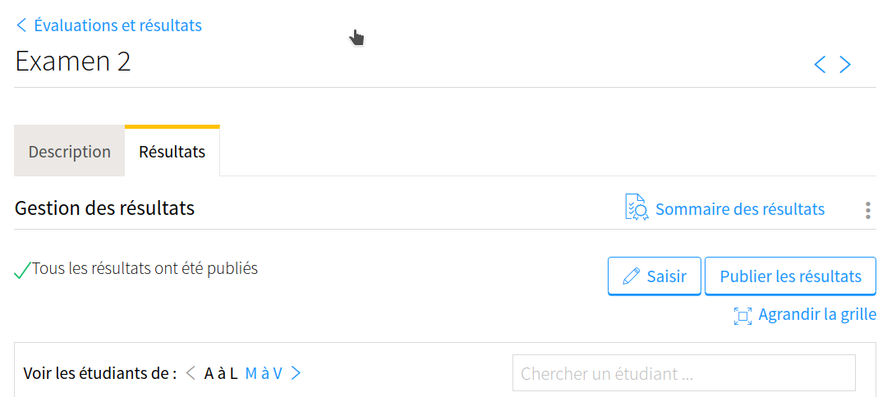
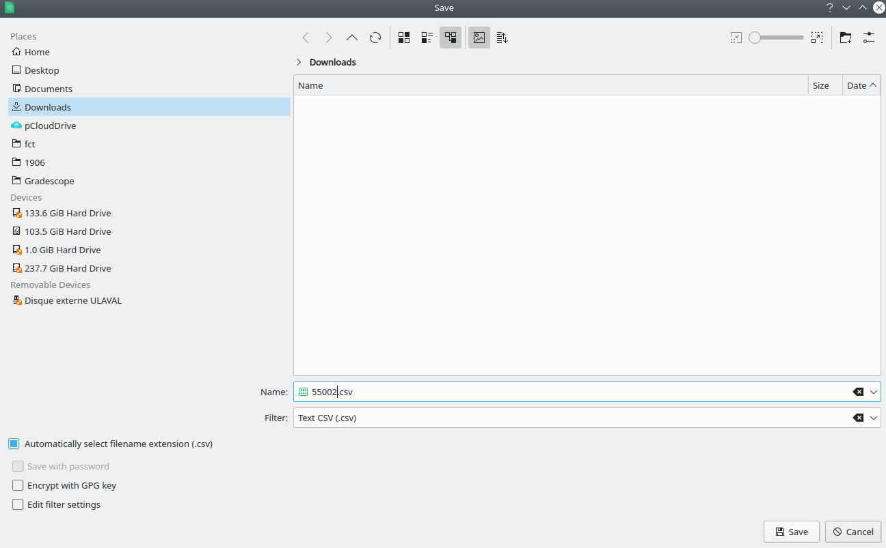

Préparation des fichiers CSV
-----------------------------------

1. Dans Gradescope, une fois la correction terminée, cliquez sur **Review Grades** dans le menu de gauche.
2. Cliquez sur le bouton **Download Grades** au bas de la fenêtre, puis choisissez de télécharger le fichier au format CSV. Ne renommez pas ce fichier.
3. Dans monPortail, télécharger la grille des résultats (Excel). Il vous faut cliquer sur les **trois points verticaux** au-dessus du bouton Publier les résultats.

    
4. Ouvrez ensuite le fichier Excel (xls) téléchargé. Pour chacune des feuilles du classeur (il y en a une par section), enregitrez-la au format CSV. Nommez chaque feuille en utilisant le NRC de la section correspondante (par exemple `55002.csv`).

   
5. Assurez-vous que le fichier CSV obtenu de Gradescope ainsi que chacun des fichiers CSV obtenus du fichier Excel de monPortail soient dans le même dossier.
